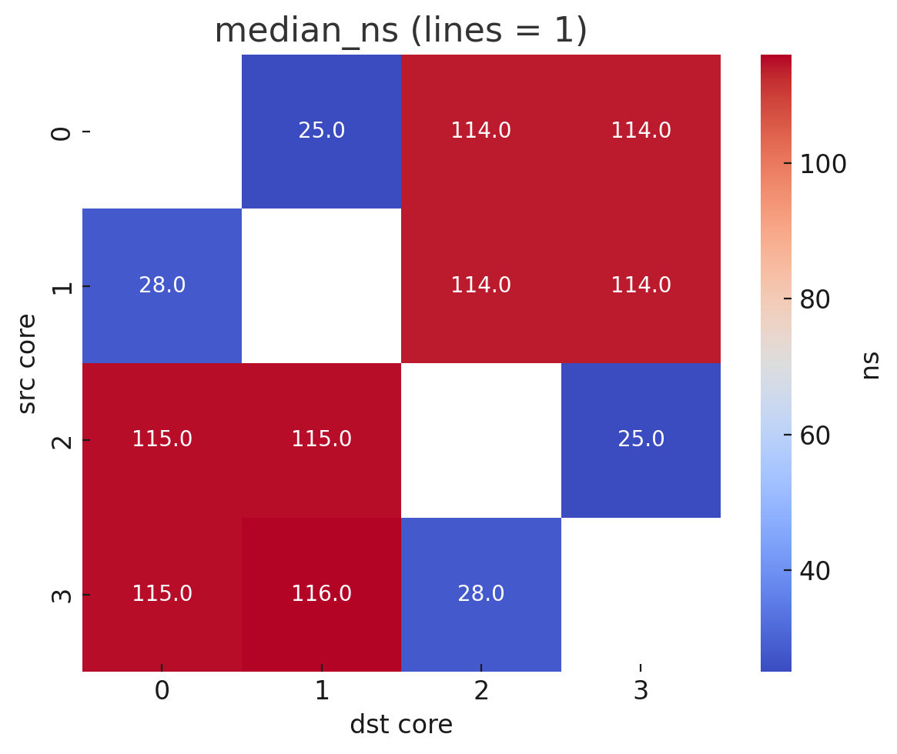
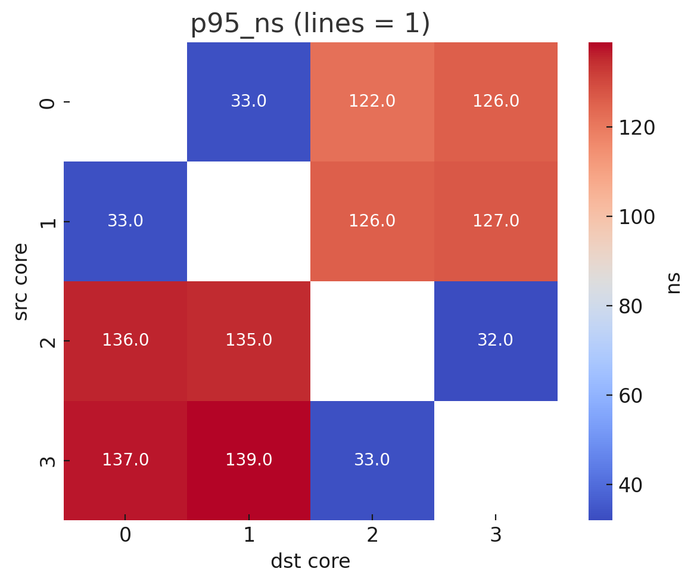
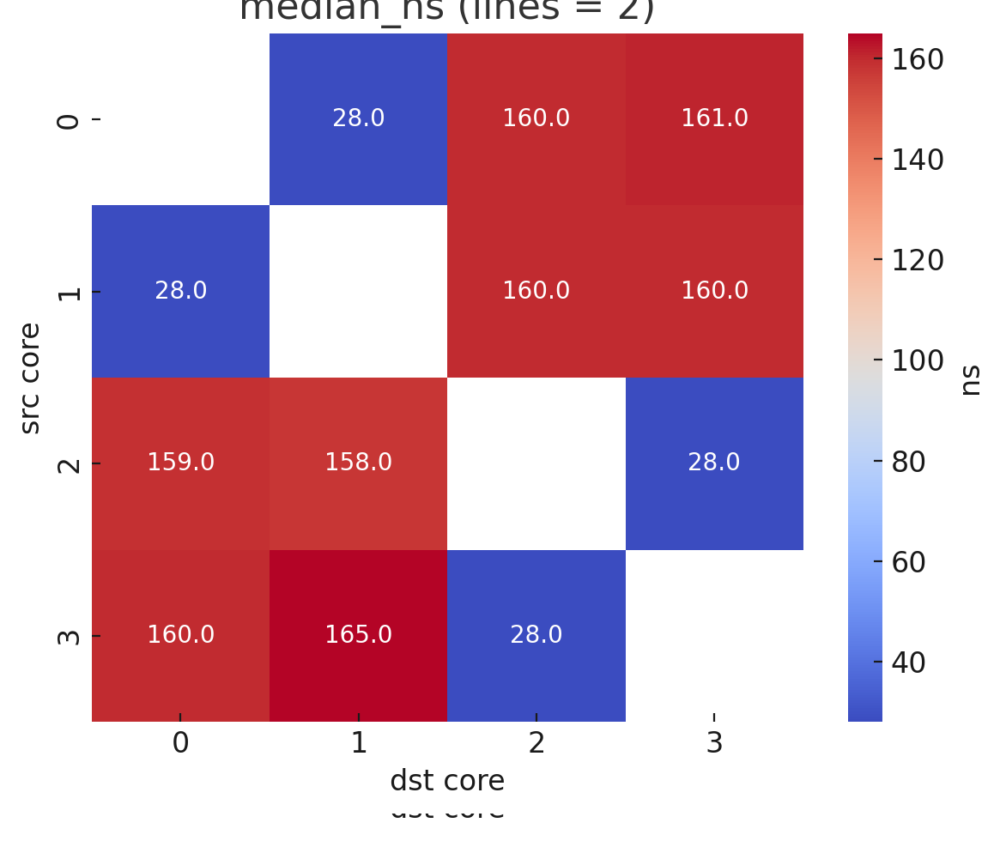
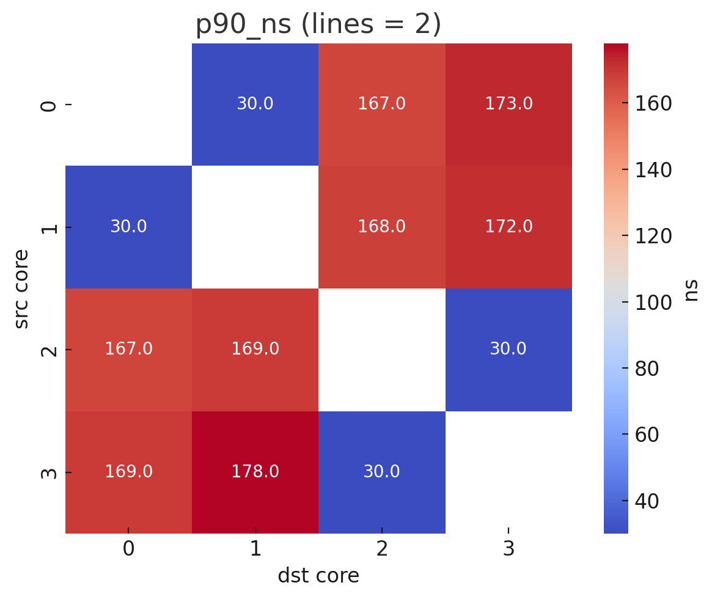

# 🏎️ Core Latecy

C++-утилита **`core_latency.cpp`** измеряет *одностороннюю* задержку
(half-RTT) пересылки **1**-й и **2**-х кэш-линий (64 Б / 128 Б) между
каждой парой логических ядер в одном процессоре под Linux.
Результаты выводятся в CSV.


## Старт

```bash
# 1. сборка
g++ -O3 -std=c++20 -pthread -march=native src/core_latency.cpp -o core_latency

# 2. измерение (1 млн итераций)
./core_latency 1000000 > results/results.csv
```

### Принцип работы
1   Для пары ядер src → dst создаются два потока и фиксируются (sched_setaffinity).
2	Поток-отправитель записывает счётчик seq в атомик line1 (и line2, если lines=2).
3	Поток-получатель спин-читает, ловит seq, подтверждает, обнуляя line1 (ACK).
4	RTT фиксируется двумя steady_clock::now(), делится пополам — получаем latency.
5	После N итераций сортируем выборку и выводим median, p90, p95.


Атомики выровнены alignas(64), так что затрагивается ровно одна
кэш-линия; memory_order_release/acquire гарантирует миграцию строки по
MESI-шине.


### Чтение CSV

src,dst,lines,median_ns,p90_ns,p95_ns
0,1,1,28.0,31.0,33.0
│ │ │ │     │     └─ 95-й перцентиль (5 % худших медленнее)
│ │ │ │     └────── 90-й перцентиль
│ │ │ └──────────── медиана, нс
│ │ └────────────── 1: 64 Б, 2: 128 Б
│ └──────────────── ядро-получатель
└────────────────── ядро-отправитель


### Интерпретация
медиана 28 нс для «0→1, 1 линия» означает, что гиперпотоки одного ядра
обмениваются строкой за ~28 нс; пары 0→2 дают ~115 нс — это уже переход
между физическими ядрами.


### Замечания
Таймер: steady_clock::now() добавляет немного нс систематической
погрешности; она одинакова для всех пар, так что относительные разницы
корректны.

NUMA-многосокетные системы не учитываются (тест охватывает только
sysconf(_SC_NPROCESSORS_ONLN), то есть один узел).


### Результаты замеров для файла results1.csv для 1млн итераций


### Median latency (1 line)


### p90 latency (1 line)


### p95 latency (1 line)


### Median latency (2 lines)


### p90 latency (2 lines)


### p95 latency (2 lines)


### Результаты замеров для файла results.csv для 100млн итераций


### Median latency (1 line)


### p90 latency (1 line)


### p95 latency (1 line)


### Median latency (2 lines)


### p90 latency (2 lines)


### p95 latency (2 lines)

